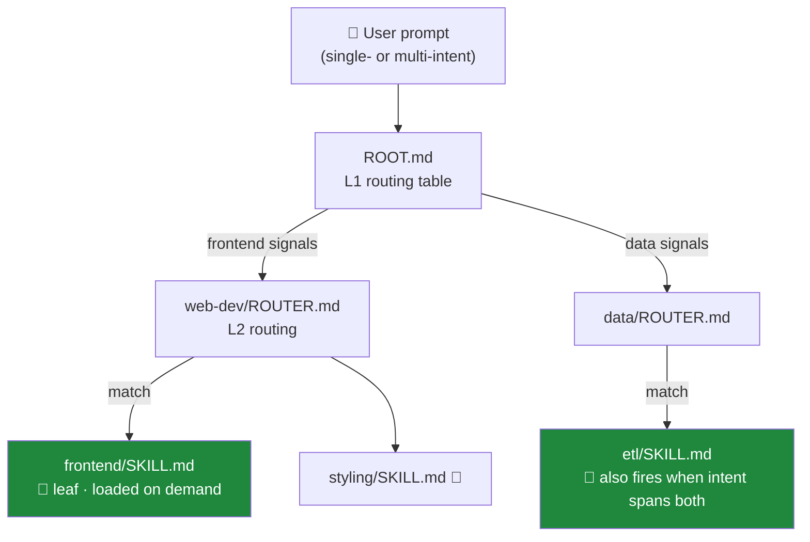

<div align="center">


# Skill Tree Generator

**Your agent doesn't need every skill in context — just the ones it needs.**

Turn a flat pile of agent skills into a hierarchical **routing tree** your AI agent
walks on demand, loading only the leaves it actually needs — one for a focused task,
several in parallel when the prompt spans intents.

[](LICENSE)
[](#-status)
[](CONTRIBUTING.md)
[-success.svg)](#-how-it-works)
[](https://github.com/maipianworni/SkillTree)

**English** · [中文](README.zh.md)

<sub>Works with **Claude Code** · **Codex CLI** · **OpenCode** · **OpenClaw** · **Bitfun** · **Hermes** · and any agent that reads `AGENTS.md` (Cursor, Aider, Jules…)</sub>


</div>

---

## 😩 The problem

Skills are great — until you have a lot of them. Every `SKILL.md` your agent can see has to
be **loaded or scanned on every turn**. The more capabilities you add, the worse it gets:

- 🧠 **Context bloat** — dozens of full skill files compete for the window
- 🎯 **Worse routing** — the agent must read everything before deciding what to use
- 💸 **Higher cost & latency** — you pay for tokens you never needed this turn

```text
BEFORE — flat skills, all loaded every turn
.claude/skills/
├── web-dev/SKILL.md        ┐
├── data-pipeline/SKILL.md  │
├── pdf-tools/SKILL.md      ├──▶  everything in context  ──▶  🧠💥 bloat
├── seo-audit/SKILL.md      │
└── …20 more/SKILL.md       ┘
```

## ✨ The solution

**Skill Tree Generator** restructures your skills into a tree of tiny routing files
(`ROOT.md → ROUTER.md → leaf SKILL.md`). The agent reads a small routing table first,
narrows down branch by branch, and **loads only the leaves it needs** — never the whole catalog.

```text
AFTER — a routing tree, leaves loaded on demand
.claude/skills/my-tree/
├── ROOT.md             ◀── agent reads this first (a tiny routing table)
│      └─ narrows to one branch…
├── web-dev/ROUTER.md   ◀── …then one sub-branch…
│      └─ frontend/SKILL.md   ◀── ✅ this leaf is loaded on demand
└── data-pipeline/ROUTER.md
```

---

## 🌳 How it works

The agent follows a routing protocol before answering: read `ROOT.md`, match the intent,
descend through `ROUTER.md` files, stop at the `[LEAF NODE]`(s) it needs, and execute those —
and only those. A focused prompt lands on a single leaf; a multi-intent or cross-domain prompt
**fans out to every matched leaf** and reads them in parallel — you're never locked to one branch.



It works in **three modes**:

| Mode | Command | What it does |
|------|---------|--------------|
| 🌱 **Generate** | `/skill-tree-generator <skill>` | Turn one monolithic skill into a routing tree |
| 🪢 **Aggregate** | `/skill-tree-generator --aggregate a,b,… [--domain x]` | Merge many skills into one cross-domain tree, with shared capabilities deduplicated |
| 🌿 **Update** | `/skill-tree-generator --update <tree-path> --add <skill>` | Add a new skill to an existing tree incrementally |

---

## 🚀 Quickstart (≈60 seconds, Claude Code)

```bash
# 1. Put the generator into your skills directory
cp -r skill-tree-generator .claude/skills/

# 2. Scan your skills — this prints the exact command to run
./scripts/aggregate-skills.sh .claude/skills
```

Then **paste the printed `/skill-tree-generator …` command into Claude Code.** That's it.

You get:

- 🌳 A skill tree at `.claude/skills/{name}-tree/`
- 📌 The routing protocol appended to your root `CLAUDE.md` (created if missing)

<details>
<summary><b>Using a different agent?</b> (Codex CLI · OpenCode · OpenClaw · Bitfun · Hermes)</summary>

The flow is the same everywhere — **drop the skill in → run the scanner → paste the printed command back**. Only the directory and the `--agent` flag change:

```bash
./scripts/aggregate-skills.sh <skills-dir> --agent <agent>
```

| Agent | Command |
|-------|---------|
| Claude Code | `./scripts/aggregate-skills.sh .claude/skills` |
| Codex CLI | `./scripts/aggregate-skills.sh .agent/skills --agent codex` |
| OpenCode | `./scripts/aggregate-skills.sh .opencode/skills --agent opencode` |
| OpenClaw | `./scripts/aggregate-skills.sh .openclaw/skills --agent openclaw` |
| Bitfun | `./scripts/aggregate-skills.sh .bitfun/skills --agent bitfun` |
| Hermes | `./scripts/aggregate-skills.sh .hermes/skills --agent hermes` |

The scanner prints the precise instruction to paste into each agent (some want a bare
`/skill-tree-generator …`, others want a `Read …/SKILL.md and execute: …` prefix).

**Codex CLI — one-time setup** so it recognizes the `/skill-tree-generator` prompt:

```bash
./scripts/install-codex-prompt.sh   # copies SKILL.md → ~/.codex/prompts/skill-tree-generator.md
```

(If you'd rather not install the custom prompt, just tell Codex to read
`…/skill-tree-generator/SKILL.md` and run the aggregate command — the scanner output shows how.)

</details>

---

## 👀 See it in action

Run the generator on your skills, and you get a self-contained tree like this:

```text
my-tree/
├── ROOT.md                     # L1: routing table (the entry point)
├── SKILL-TREE.md               # human-readable overview + capability map
├── GENERATION-REPORT.md        # evidence of how the tree was built
│
├── web-dev/
│   ├── ROUTER.md               # L2: narrows within the module
│   └── frontend/SKILL.md       # 🍃 [LEAF NODE] — the actual instructions
│
├── data-pipeline/
│   └── ROUTER.md
│       └── etl/SKILL.md        # 🍃 [LEAF NODE]
│
├── shared/                     # capabilities common to several skills (deduped)
│   └── export/SKILL.md         # 🍃 used by web-dev + data-pipeline
│
└── cross-cutting/
    └── SKILL.md                # multi-skill workflows (pipelines, combos)
```

…and a `ROOT.md` whose job is simply to point the agent at the right branch:

```markdown
# My Domain Routing Protocol [MANDATORY]

## Step 1: L1 routing
| Task category        | Route to                          |
|----------------------|-----------------------------------|
| Frontend / UI        | Read `web-dev/ROUTER.md`          |
| Data / pipelines     | Read `data-pipeline/ROUTER.md`    |
| Export / reporting   | Read `shared/export/SKILL.md`     |

## Step 2: recurse until you hit a file marked [LEAF NODE], then execute it.
```

---

## 🎁 Features

- 🌱 **Three modes** — generate from one skill, aggregate many, or update a tree in place
- 🔌 **Multi-agent** — Claude Code, Codex CLI, OpenCode, OpenClaw, Bitfun, Hermes & any `AGENTS.md` reader
- 🍃 **Load on demand** — only the matched leaves enter context, never the whole catalog
- 🪢 **Multi-leaf routing** — a multi-intent prompt fans out to every matched leaf in parallel; you're never locked to a single branch
- 🧩 **Shared-capability dedup** — overlapping abilities across skills collapse into one shared leaf
- 🔗 **Cross-cutting workflows** — multi-skill pipelines are first-class, not afterthoughts
- 📦 **Self-contained leaves** — no dangling external references; every leaf stands alone
- 🔍 **Optional routing trace** — say "debug routing" to watch which node actually fired
- ✅ **Strict validation** — coverage, reachability & content-preservation checks on every build
- 📚 **Battle-tested** — 16 documented [lessons learned](skill-tree-generator/references/lessons_learned.md) baked into the rules
- 🪶 **Zero dependencies** — pure Bash + Markdown, nothing to install

---

## 🤖 Supported agents & paths

| Agent | Skills directory | Memory file |
|-------|------------------|-------------|
| Claude Code | `.claude/skills/` | `CLAUDE.md` |
| Codex CLI | `.agent/skills/` | `AGENTS.md` |
| Bitfun | `.bitfun/skills/` | `AGENTS.md` |
| OpenClaw | `.openclaw/skills/` | `AGENTS.md` |
| OpenCode | `.opencode/skills/` | `AGENTS.md` |
| Hermes | `.hermes/skills/` | `AGENTS.md` |

Any other agent that reads `AGENTS.md` (Cursor, Aider, Jules…) works the same way.

<details>
<summary><b>Want one repo to serve two agents at once?</b></summary>

Maintain a single copy and symlink the rest:

```bash
# Keep skills in the Codex layout, let Claude Code discover them too
ln -s .agent/skills .claude/skills

# Share one memory file
ln -s AGENTS.md CLAUDE.md
```

</details>

---

## 📟 Calling the skill directly

```bash
# 1. Single skill → tree
/skill-tree-generator <skill>

# 2. Multiple skills → one cross-domain tree
/skill-tree-generator --aggregate skill1,skill2,… [--domain domain-name]

# 3. Update an existing tree
/skill-tree-generator --update <tree-path> --add <skill>
```

---

## 💡 Tips

1. Make sure your memory file (e.g. `CLAUDE.md`) sits at the repo root and contains the
   routing protocol (template: `skill-tree-generator/references/validation_template.md`, **Check 1**).
2. After generating the tree, clear the other loose skills from your skills dir — it makes
   it much easier to confirm the tree is doing the routing.
3. Run a real task or prompt and check that routing "fires" the skill node you expected.

### 🔍 Routing trace (optional)

Include **"debug routing"** / **"路由追踪"** in your prompt to turn on trace mode — the agent
prints which node it routed to, so you can verify the tree actually reached the right leaf.
By default trace is **off** and the agent just executes.

---

## 🗂️ Project structure

<details>
<summary>What's in this repo</summary>

```text
SkillTree/
├── README.md / README.zh.md      # you are here
├── scripts/
│   ├── aggregate-skills.sh        # scans a skills dir, prints the command to run
│   └── install-codex-prompt.sh    # one-time Codex CLI setup
├── skill-tree-generator/          # the skill itself
│   ├── SKILL.md                   # the full specification (3 modes)
│   └── references/                # templates, validation, error handling, lessons learned
└── images/                        # banner + demo gif
```

</details>

---

## 🧪 Status

> ⚠️ **Research Preview.** APIs, file layouts, and routing conventions may change.
> Feedback and issues are very welcome.

## 🤝 Contributing

PRs and ideas are welcome — see [CONTRIBUTING.md](CONTRIBUTING.md). If you hit a routing
edge case, the [lessons learned](skill-tree-generator/references/lessons_learned.md) doc is
the best place to capture it.

## 📄 License

[MIT](LICENSE) © Skill Tree Generator contributors
