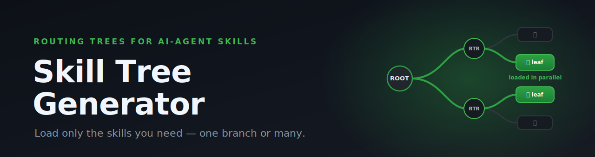
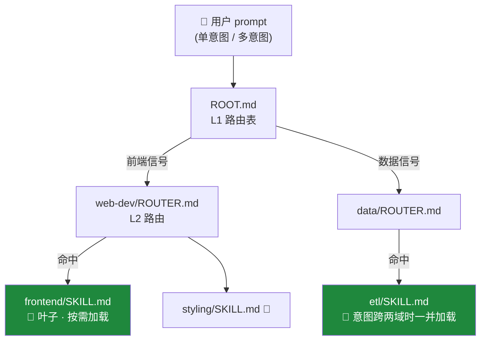

<div align="center">



# Skill Tree Generator

**别再把所有 skill 一股脑塞进上下文 —— agent 只需要其中用得上的那些。**

把庞杂的 agent skills 重构成分层 **路由树**，让 AI agent 按需逐层下钻，
只加载它真正需要的那些叶子节点 —— 单一任务命中一个，跨意图时并行命中多个。

[](LICENSE)
[](#-状态)
[](CONTRIBUTING.md)
[-success.svg)](#-工作原理)
[](https://github.com/maipianworni/SkillTree)

[English](README.md) · **中文**

<sub>支持 **Claude Code** · **Codex CLI** · **OpenCode** · **OpenClaw** · **Bitfun** · **Hermes** · 以及任何读取 `AGENTS.md` 的 agent（Cursor、Aider、Jules…）</sub>


</div>

---

## 😩 痛点

Skill 很好用 —— 直到你的 skill 多起来。agent 能看到的每个 `SKILL.md`，**每一轮对话都要被加载或扫描**。
能力越多，问题越严重：

- 🧠 **上下文膨胀** —— 几十个完整 skill 文件争抢有限的上下文窗口
- 🎯 **路由变差** —— agent 得先读完所有内容才能决定用哪个
- 💸 **成本与延迟上升** —— 你为这一轮根本用不到的 token 买单

```text
之前 —— 扁平 skills，每轮全量加载
.claude/skills/
├── web-dev/SKILL.md        ┐
├── data-pipeline/SKILL.md  │
├── pdf-tools/SKILL.md      ├──▶  全部进上下文  ──▶  🧠💥 膨胀
├── seo-audit/SKILL.md      │
└── …还有 20 个/SKILL.md     ┘
```

## ✨ 解法

**Skill Tree Generator** 把你的 skills 重构成一棵由微型路由文件组成的树
（`ROOT.md → ROUTER.md → 叶子 SKILL.md`）。agent 先读一张很小的路由表，
一层层收窄，**只加载它需要的那些叶子** —— 而不是整个目录。

```text
之后 —— 一棵路由树，叶子按需加载
.claude/skills/my-tree/
├── ROOT.md             ◀── agent 先读这个（一张很小的路由表）
│      └─ 收窄到一个分支…
├── web-dev/ROUTER.md   ◀── …再到一个子分支…
│      └─ frontend/SKILL.md   ◀── ✅ 这个叶子按需加载
└── data-pipeline/ROUTER.md
```

---

## 🌳 工作原理

agent 在回答之前先执行路由协议：读 `ROOT.md`，匹配意图，沿着 `ROUTER.md` 逐层下钻，
停在它需要的 `[LEAF NODE]` 节点并执行 —— 单意图 prompt 命中一个叶子；
多意图或跨域 prompt 会**扇出到每一个命中的叶子并并行读取**，绝不会被锁死在单个分支上。



它有 **三种模式**：

| 模式 | 命令 | 作用 |
|------|------|------|
| 🌱 **生成** | `/skill-tree-generator <skill>` | 把单个庞大 skill 转成路由树 |
| 🪢 **聚合** | `/skill-tree-generator --aggregate a,b,… [--domain x]` | 把多个 skill 合并成一棵跨域树，共享能力自动去重 |
| 🌿 **更新** | `/skill-tree-generator --update <tree-path> --add <skill>` | 向已有的树增量添加新 skill |

---

## 🚀 快速上手（约 60 秒，Claude Code）

```bash
# 1. 把 generator 放进你的 skills 目录
cp -r skill-tree-generator .claude/skills/

# 2. 扫描你的 skills —— 它会打印出要运行的精确命令
./scripts/aggregate-skills.sh .claude/skills
```

然后**把打印出的 `/skill-tree-generator …` 命令贴回 Claude Code。** 就这样。

你会得到：

- 🌳 写入 `.claude/skills/{name}-tree/` 的 skill tree
- 📌 在项目根 `CLAUDE.md` 追加路由协议（若不存在则创建）

<details>
<summary><b>用的是别的 agent？</b>（Codex CLI · OpenCode · OpenClaw · Bitfun · Hermes）</summary>

流程到处都一样 —— **放入 skill → 跑扫描脚本 → 把打印出的命令贴回去**。只有目录和 `--agent` 标志不同：

```bash
./scripts/aggregate-skills.sh <skills-dir> --agent <agent>
```

| Agent | 命令 |
|-------|------|
| Claude Code | `./scripts/aggregate-skills.sh .claude/skills` |
| Codex CLI | `./scripts/aggregate-skills.sh .agent/skills --agent codex` |
| OpenCode | `./scripts/aggregate-skills.sh .opencode/skills --agent opencode` |
| OpenClaw | `./scripts/aggregate-skills.sh .openclaw/skills --agent openclaw` |
| Bitfun | `./scripts/aggregate-skills.sh .bitfun/skills --agent bitfun` |
| Hermes | `./scripts/aggregate-skills.sh .hermes/skills --agent hermes` |

扫描脚本会打印出贴回每个 agent 的精确指令（有的要纯 `/skill-tree-generator …`，
有的要带 `Read …/SKILL.md and execute: …` 前缀）。

**Codex CLI —— 一次性设置**，让它认识 `/skill-tree-generator` prompt：

```bash
./scripts/install-codex-prompt.sh   # 把 SKILL.md 拷到 ~/.codex/prompts/skill-tree-generator.md
```

（如果你不想安装 custom prompt，也可以直接让 Codex 读
`…/skill-tree-generator/SKILL.md` 并执行聚合命令 —— 脚本输出里会提示具体写法。）

</details>

---

## 👀 实际产出长什么样

对你的 skills 运行 generator，你会得到一棵自包含的树：

```text
my-tree/
├── ROOT.md                     # L1：路由表（入口）
├── SKILL-TREE.md               # 人类可读的概览 + 能力映射表
├── GENERATION-REPORT.md        # 这棵树是如何生成的证据
│
├── web-dev/
│   ├── ROUTER.md               # L2：在模块内继续收窄
│   └── frontend/SKILL.md       # 🍃 [LEAF NODE] —— 真正的执行指令
│
├── data-pipeline/
│   └── ROUTER.md
│       └── etl/SKILL.md        # 🍃 [LEAF NODE]
│
├── shared/                     # 多个 skill 共有的能力（去重）
│   └── export/SKILL.md         # 🍃 web-dev + data-pipeline 共用
│
└── cross-cutting/
    └── SKILL.md                # 跨 skill 工作流（pipeline、组合）
```

……以及一份 `ROOT.md`，它的职责就是把 agent 指向正确的分支：

```markdown
# My Domain Routing Protocol [MANDATORY]

## Step 1: L1 路由
| 任务类别        | 路由目标                           |
|----------------|-----------------------------------|
| 前端 / UI       | Read `web-dev/ROUTER.md`          |
| 数据 / 管道     | Read `data-pipeline/ROUTER.md`    |
| 导出 / 报表     | Read `shared/export/SKILL.md`     |

## Step 2: 递归路由，直到遇到标有 [LEAF NODE] 的文件，然后执行它。
```

---

## 🎁 特性

- 🌱 **三种模式** —— 单 skill 生成、多 skill 聚合、原地更新
- 🔌 **多 agent** —— Claude Code、Codex CLI、OpenCode、OpenClaw、Bitfun、Hermes 及任何 `AGENTS.md` 读取者
- 🍃 **按需加载** —— 只有命中的叶子进入上下文，绝不是整个目录
- 🪢 **多叶路由** —— 多意图 prompt 会并行扇出到每一个命中的叶子，绝不被锁死在单个分支
- 🧩 **共享能力去重** —— 跨 skill 的重叠能力合并成一个共享叶子
- 🔗 **跨域工作流** —— 多 skill 流水线是一等公民，而非事后补丁
- 📦 **自包含叶子** —— 不留外部引用悬空；每个叶子都能独立成立
- 🔍 **可选路由追踪** —— 说一句 "路由追踪" 就能看到实际触发了哪个节点
- ✅ **严格校验** —— 每次构建都做覆盖、可达性、内容保全检查
- 📚 **实战打磨** —— 16 条 [lessons learned](skill-tree-generator/references/lessons_learned.md) 已固化进规则
- 🪶 **零依赖** —— 纯 Bash + Markdown，无需安装

---

## 🤖 支持的 Agent 与路径约定

| Agent | Skill 目录 | 记忆文件 |
|-------|-----------|---------|
| Claude Code | `.claude/skills/` | `CLAUDE.md` |
| Codex CLI | `.agent/skills/` | `AGENTS.md` |
| Bitfun | `.bitfun/skills/` | `AGENTS.md` |
| OpenClaw | `.openclaw/skills/` | `AGENTS.md` |
| OpenCode | `.opencode/skills/` | `AGENTS.md` |
| Hermes | `.hermes/skills/` | `AGENTS.md` |

其他读取 `AGENTS.md` 的 agent（Cursor、Aider、Jules…）同理。

<details>
<summary><b>同一仓库想让两种 Agent 都用？</b></summary>

推荐做法（只维护一份）：

```bash
# skill 目录用 Codex 风格，软链让 Claude Code 也能发现
ln -s .agent/skills .claude/skills

# 记忆文件共用一份
ln -s AGENTS.md CLAUDE.md
```

</details>

---

## 📟 直接调用 Skill

```bash
# 1. 单个 skill → 树
/skill-tree-generator <skill>

# 2. 多个 skill → 一棵跨域树
/skill-tree-generator --aggregate skill1,skill2,… [--domain domain-name]

# 3. 更新已有的树
/skill-tree-generator --update <tree-path> --add <skill>
```

---

## 💡 推荐用法

1. 记忆文件（例如 `CLAUDE.md`）放在根目录，确认它包含路由协议
   （模板见 `skill-tree-generator/references/validation_template.md` 的 **Check 1**）。
2. skills 目录（例如 `.claude/skills`）下生成 Skill Tree 以后，把其他 skill 清空，
   可以更好地测试 Skill Tree 的效果。
3. 运行任务或输入 prompt，测试能否通过 Skill Tree 的路由功能"触发"相关的 Skill。

### 🔍 路由追踪 [可选]

- 当用户 prompt 包含 **"路由调试"** / **"debug routing"** / **"路由追踪"** 时，激活路由追踪模式，
  该模式可输出路由追踪日志，可查看 skill-tree 是否实际触发到了用户需要的 skill 节点。
- **正常模式**（默认）：不输出任何路由信息，直接执行。

---

## 🗂️ 项目结构

<details>
<summary>这个仓库里有什么</summary>

```text
SkillTree/
├── README.md / README.zh.md      # 你正在看的文档
├── scripts/
│   ├── aggregate-skills.sh        # 扫描 skills 目录，打印要运行的命令
│   └── install-codex-prompt.sh    # Codex CLI 一次性设置
├── skill-tree-generator/          # skill 本体
│   ├── SKILL.md                   # 完整规范（三种模式）
│   └── references/                # 模板、校验、错误处理、lessons learned
└── images/                        # banner + 演示 gif
```

</details>

---

## 🧪 状态

> ⚠️ **Research Preview。** 接口、文件布局和路由约定都可能变化。
> 非常欢迎反馈和 issue。

## 🤝 贡献

欢迎 PR 和想法 —— 见 [CONTRIBUTING.md](CONTRIBUTING.md)。如果你遇到路由边界情况，
[lessons learned](skill-tree-generator/references/lessons_learned.md) 是记录它的最佳位置。

## 📄 许可证

[MIT](LICENSE) © Skill Tree Generator contributors
